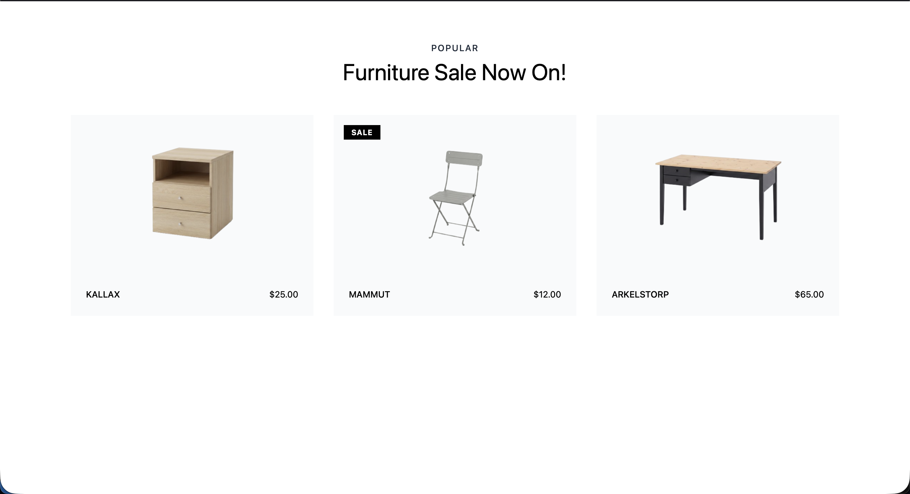
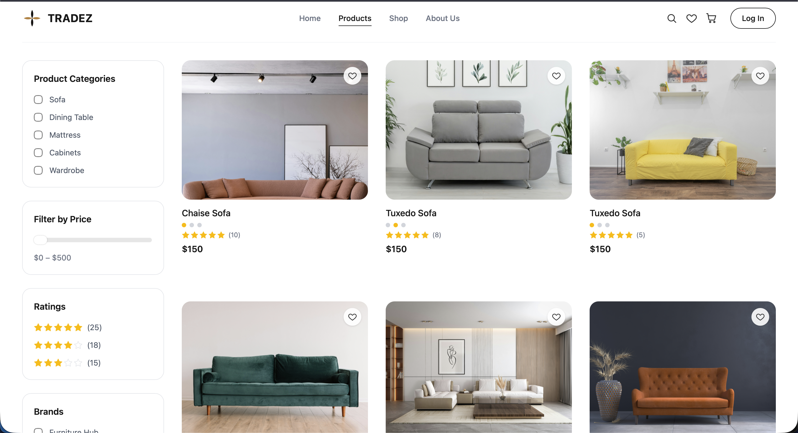
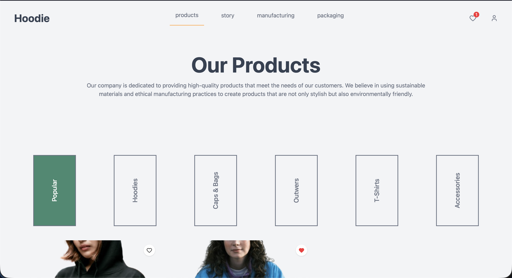

# E-Commerce-Projects

A collection of small e-commerce UI templates and components, built to practice
frontend patterns commonly found in online stores.

## Projects

### [Product-Card](./Product-Card)


A single product card UI built with React, Vite, and Tailwind CSS.

**Features**

- Product image panel with a toggleable wishlist (heart) button
- Size and color tags
- Product title, description, and price
- "Add to cart" call-to-action

**Stack:** React 19, Vite, Tailwind CSS v4

**Run locally**

```bash
cd Product-Card
npm install
npm run dev
```

### [Tripple-Product-Card](./Tripple-Product-Card)



A responsive furniture sale grid built with React, Vite, and Tailwind CSS, rendering three product cards from a simulated inventory payload.

**Features**

- Responsive grid layout (1 column on mobile, 2 on tablet, 3 on desktop)
- Product image, name, and price per card
- Automatic "Sale" badge when an item has a discounted price
- Data-driven cards rendered from an inventory array

**Stack:** React 19, Vite, Tailwind CSS v4

**Run locally**

```bash
cd Tripple-Product-Card
npm install
npm run dev
```

### [Product-Catalog-Grid](./Product-Catalog-Grid)



A full catalog page layout built with React, Vite, and Tailwind CSS, combining a filter sidebar with a responsive product grid.

**Features**

- Sidebar filters for categories, price range, ratings, and brands
- Responsive product grid (1 column on mobile, up to 3 on desktop)
- Product cards with wishlist toggle, color swatches, star ratings, and review counts
- Data-driven products and filters rendered from static data files

**Stack:** React 19, Vite, Tailwind CSS v4

**Run locally**

```bash
cd Product-Catalog-Grid
npm install
npm run dev
```

### [WishList-Project](./WishList-Project)



A product hero and wishlist landing page built with React, Vite, and Tailwind CSS, featuring a category-filtered product hero and a live wishlist counter in the navbar.

**Features**

- Navbar with category links and a wishlist icon showing a live count badge
- Hero section with vertical category filter buttons
- Product cards with wishlist toggle, rendered from a data-driven product list
- Icons via `lucide-react`

**Stack:** React 19, Vite, Tailwind CSS v4

**Run locally**

```bash
cd WishList-Project
npm install
npm run dev
```
