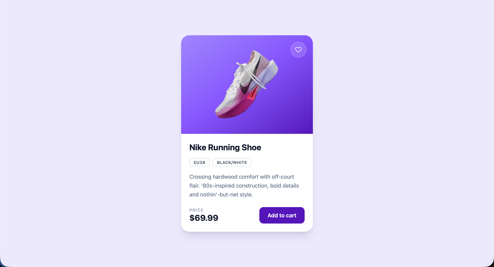

# E-Commerce-Projects

A collection of small e-commerce UI templates and components, built to practice
frontend patterns commonly found in online stores.

## Projects

### [Product-Card](./Product-Card)



A single product card UI built with React, Vite, and Tailwind CSS.

**Features**

- Product image panel with a toggleable wishlist (heart) button
- Size and color tags
- Product title, description, and price
- "Add to cart" call-to-action

**Stack:** React 19, Vite, Tailwind CSS v4

**Run locally**

```bash
cd Product-Card
npm install
npm run dev
```
